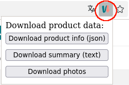
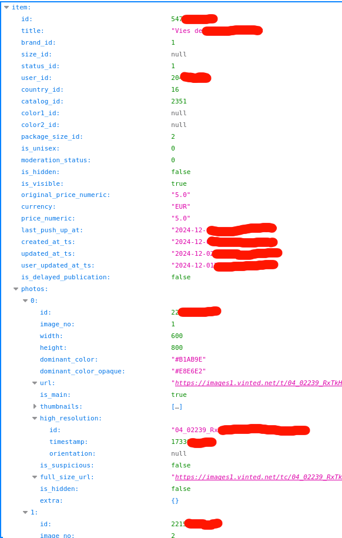

# Vinted Downloader Extension

Vinted is an online marketplace for buying and selling second hand items, mostly clothes.

This Firefox extension let you download and save:

- product: complete item description (json) and full resolution photos,
- conversation: complete conversation including full resolution images, and tracking information.

This is useful to archive information about your transactions on Vinted, since sold items may be deleted by the seller and the conversation are deleted automatically by Vinted after a few months.

Once installed, if you go to a product page (`https://www.vinted.<TLD>/items/<ID>`, where `<TLD>` is the country code top level domain like `.fr`, `it`, `es`, etc.) or a conversation (`https://www.vinted.<TLD>/inbox/<ID>`), you will see the extension icon in the address bar. If you click on it, buttons will let you download data and full resolution photos about the product or the conversation.

For a product page:

For a conversation page:

Depending on your Firefox settings, the data and images will be directly downloaded in your download directory, or a "save as" dialog will ask you where you want to save the file(s).

Note that when you click on the "Download images" button, **all images** are downloaded automatically (depending on your settings, a "save as" dialog will be shown for each file, with a default filename).

The default filenames are:

- for the product description: `vinted-item-<ITEM_ID>.json`
- for the product summary (a text file with the url, title, description and seller username and id): `vinted-item-<ITEM_ID>-summary.txt`
- for the product photos: `vinted-item-<ITEM_ID>-photo-<PHOTO_ID>.jpg`
- for the conversation: `vinted-conversation-<CONVERSATION_ID>.json`
- for the images in the conversation: `vinted-conversation-<CONVERSATION_ID>-photo-<PHOTO_ID>.jpg`
- for the tracking: `vinted-conversation-<CONVERSATION_ID>-shipment.json`

The JSON format is a way to represent information. You can open the file with Firefox for a better "reading" experience.

Here is the beginning of an example of a product description file:

Here is the beginning of an example of a conversation file:

Here is the beginning of an example of a tracking file:

## Installation from the source

You can download the GitHub repository, check/modify the code, and then run it in Firefox:

- go to the add-ons settings (or `about:addons`)
- click on the gear icon at the right of "Personalize Your Firefox"
- click on "Debug add-ons"
- click on "Load Temporary Add-on"
- select the `manifest.json`

Or:

- go to `aboug:debugging`
- select "This Firefox"
- click on "Load Temporary Add-on"
- select the `manifest.json`

The add-on will be automatically removed once Firefox is closed.

## Limitations

It won't work in the United Kingdom, if the TLD is `.co.uk`.

The images in the conversation are assumed to be JPG images (I think it is the only allowed format).

## License

MIT.

## Always happy to talk

Contact me at `talk@boberle.com`.