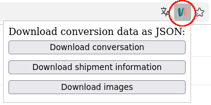
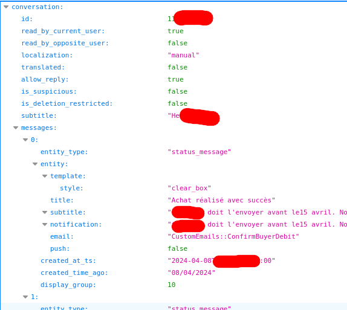
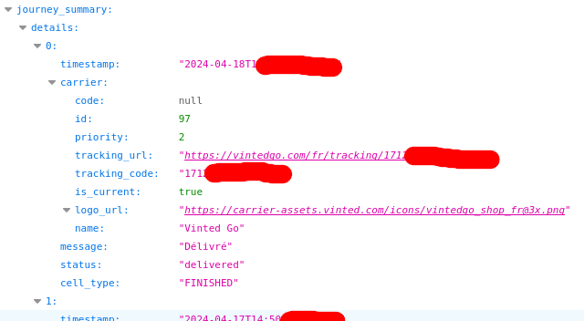

# Vinted Conversation Data Downloader Extension

When you buy or sell something on Vinted, a conversation is created, where you find messages from Vinted and from the seller/buyer. You also find shipment information (tracking). You may want to delete the conversation, or Vinted will do it for you after some time, but it's a good idea to keep a copy of the conversation, the transaction, the shipment information.

This extension let you save the conversation, transaction details, and tracking information by downloading two json files directly from the Vinted API.

It can also download all the images and photos in the conversation, in full resolution.

Once installed, if you go to a conversation (`https://www.vinted.<TDL>/inbox/<ID>`), you will see the extension icon in the address bar. If you click on it, 3 buttons will let you download the conversation, tracking and images:

Depending on your Firefox settings, the conversation/tracking/images will be directly downloaded in your download directory, or a "save as" dialog will ask you where you want to save the file(s).

Note that when you click on the "Download images" button, **all images** are downloaded automatically (depending on your settings, a "save as" dialog will be shown for each file, with a default filename).

The default filenames are:

- for the conversation: `vinted-conversation-<CONVERSATION_ID>.json`
- for the tracking: `vinted-conversation-<CONVERSATION_ID>-shipment.json`
- for the photos: `vinted-conversation-<CONVERSATION_ID>-photo-<PHOTO_ID>.jpg`

Here is the beginning of an example of a conversation file (opened in Firefox):

Here is the beginning of an example of a tracking file (opened in Firefox):

## Installation from the source

You can download the GitHub repository, check/modify the code, and then run it in Firefox:

- go to `aboug:debugging`
- select "This Firefox"
- click on "Load Temporary Add-on"
- select the `manifest.json`

The add-on will be automatically removed once Firefox is closed.

## Limitations

It won't work in the United Kingdom, if the TLD is `.co.uk`.

The images in the conversation are assumed to be JPG images (I think it is the only allowed format).

## License

MIT.

## Always happy to talk

Contact me at `talk@boberle.com`.