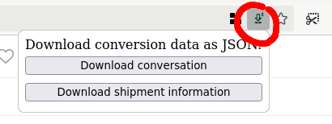

# Vinted Conversation Data Downloader Extension

When you buy or sell something on Vinted, a conversation is created, where you find messages from Vinted and from the seller/buyer. You also find shipment information (tracking). You may want to delete the conversation, or Vinted will do it for you after some time, but it's a good idea to keep a copy of the conversation, the transaction, the shipment information.

This extension let you save the conversation, transaction details, and tracking information by downloading two json files directly from the Vinted API.

Once installed, if you go to a conversation (`https://www.vinted.<TDL>/inbox/<ID>`), you will see the extension icon in the address bar. If you click, on it, two buttons will let you download the conversation and tracking:

Here is the beginning of an example of a conversation file (opened in Firefox):

Here is the beginning of an example of a tracking file (opened in Firefox):

## Installation from the source

You can download the GitHub repository, check/modify the code, and then run it in Firefox:

- go to `aboug:debugging`
- select "This Firefox"
- click on "Load Temporary Add-on"
- select the `manifest.json`

The add-on will be automatically removed once Firefox is closed.

## Limitations

It won't download pictures from the conversation.

It won't work in the United Kingdom, if the TLD is `.co.uk`.

## License

MIT.

## Always happy to talk

Contact me at `talk@boberle.com`.